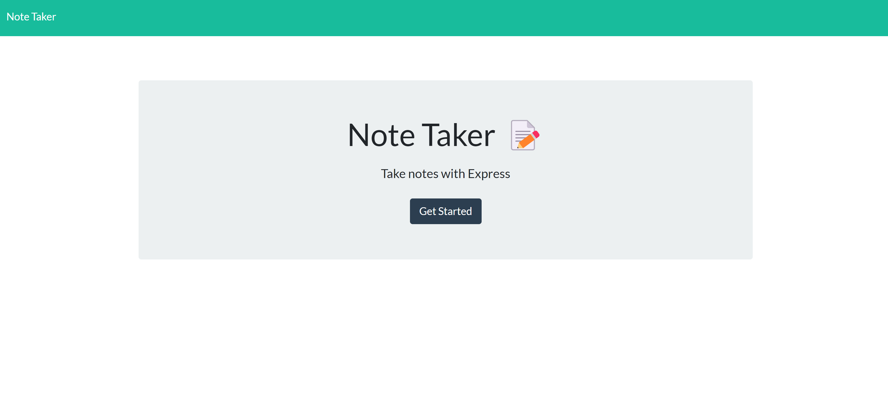
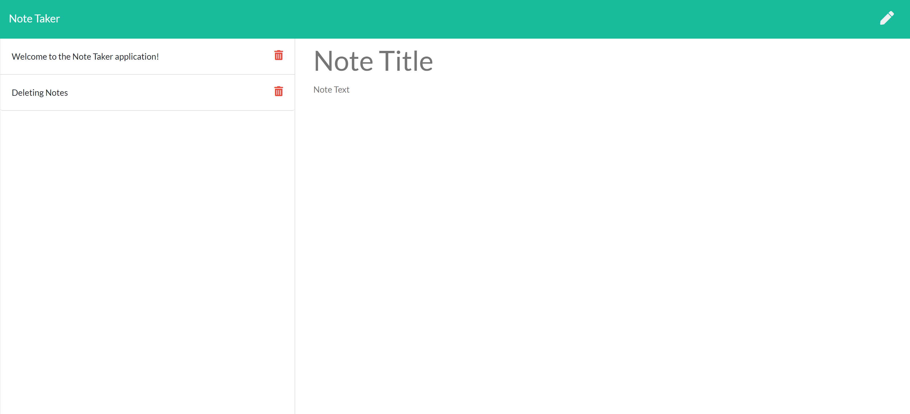

# Note-Taker-by-Jemima-Siddiqui

## Description
This application is called "Note Taker" and can be used to write and save notes. This application uses an Express.js back end and will save and retrieve note data from a JSON file.

## Table of Contents
* [Installation](#installation)
* [Usage](#usage)
* [Contributions](#contributions)
* [Testing](#testing)
* [Questions](#questions)

## Installation

### Downloading Visual Studio Code 

 Download the latest version of Visual Studio to your local machine (Mac, Linux or Windows). Please use the following link to download the latest version of VS Code [Download VS Code](https://code.visualstudio.com/download). 

### Pulling the repository from Git 

If you would like to acess the source code, please navigate to the following public Github repository [Github Repository](https://github.com/JemimaSiddiqui/Note-Taker-by-Jemima-Siddiqui.git). 

* Clone the repository to your local desktop using the following steps:

  * 🔑 Use the terminal command `cd` to navigate to the directory where we want the repository located. In this case, we will save it to the Desktop. 

  ```bash
  cd Desktop
  ```

  * 🔑 Use the git command `git clone` followed by the URL copied from Github to clone the repo to our local machine.

  ```bash
  git clone <url>
  ```

  * 🔑 Use the `git clone` command creates a new directory with the same name as the repository. We navigate into our new directory using `cd`.

  ```bash
  cd Note-Taker-by-Jemima-Siddiqui
  ```
* After the repository has been cloned to your local machine, open the files using Visual Studio application. 

## Usage
The application has been deployed to a heroku page which can be found here: [https://note-taker-by-jemima-siddiqui.herokuapp.com/notes](https://note-taker-by-jemima-siddiqui.herokuapp.com/notes). 

* Step 1: Change into the directory of the application 
* Step 2: Run by using the following command in the command terminal in VS Code. 

  ```bash
  npm start  
  ```
* Step 3: You will be presented with the following page. Click on "Get Started" to go to the page in which you can save/delete notes. 



* Step 4: You will then be taken to the page shown in the image below. Users can start adding the title and description of a new note. A save icon will then appear at the top-right corner of the screen. Users can click on that icon to save the note. They can also click on the bin icon incline with the note title to delete a note. Otherwise, users can also click on the pencil icon to add a new note. 



    
## Questions
Author: [JemimaSiddiqui](https://github.com/JemimaSiddiqui)

If you have any further questions, please feel free to contact me at: [jemimasiddiqui12@gmail.com](mailto:jemimasiddiqui12@gmail.com)
